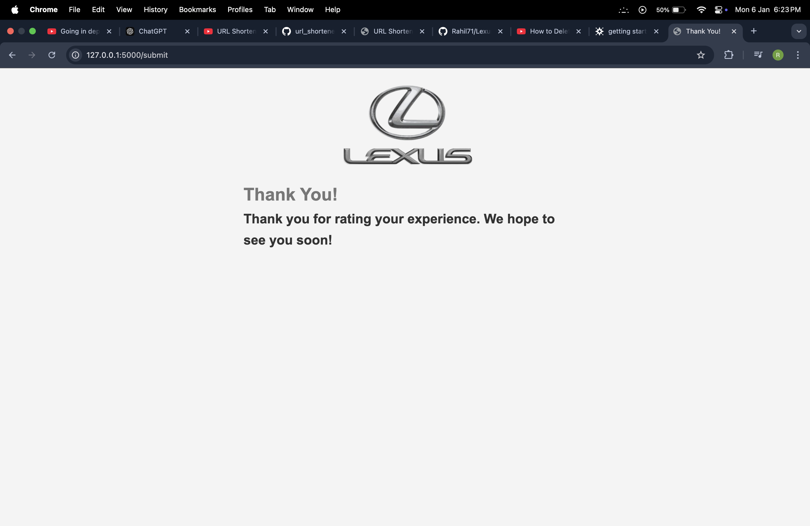
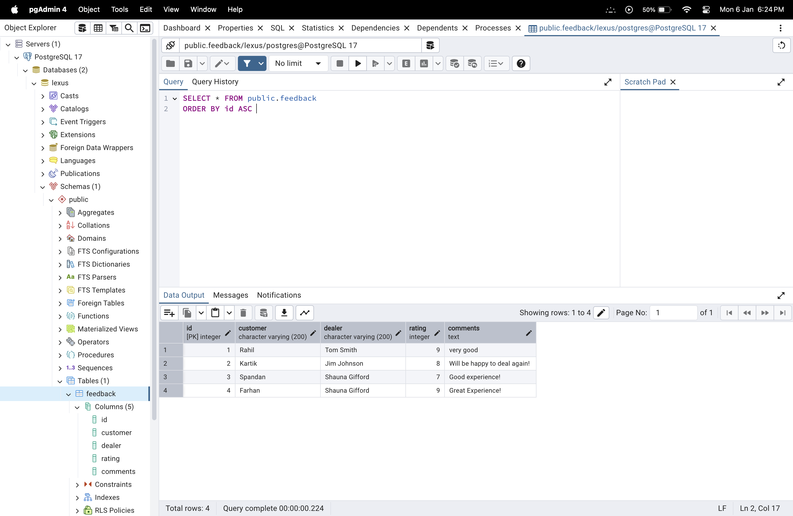

# Lexus Feedback Application

## Overview

The Lexus Feedback Application is a web-based tool that allows customers to provide feedback about their service experience with a Lexus dealer. It captures key information like the customer’s name, dealer, rating, and comments, stores the data in a PostgreSQL database, and sends an email notification upon successful submission.

---

## Features

- **User-Friendly Interface**: Intuitive form for submitting feedback with required fields validation.
- **Database Integration**: Feedback data is stored in a PostgreSQL database.
- **Email Notifications**: Sends an email notification with feedback details upon submission.
- **Duplicate Feedback Prevention**: Ensures that a customer can only submit feedback once.

---

## Tech Stack

- **Backend**: Flask (Python)
- **Frontend**: HTML, CSS
- **Database**: PostgreSQL
- **Email Service**: Mailtrap (for testing email notifications)

---

## File Structure

```
.
├── app.py               # Main application file
├── requirements.txt     # Python dependencies
├── send_mail.py         # Email functionality
├── static/
│   └── style.css        # Styling for the app
├── templates/
│   ├── index.html       # Feedback form template
│   └── success.html     # Success page template
└── README.md            # Project documentation
```

---

## Installation and Setup

1. **Clone the Repository**:
   ```bash
   git clone https://github.com/Rahil71/Lexus-Login.git
   cd lexus-feedback
   ```

2. **Set Up Virtual Environment**:
   ```bash
   python3 -m venv env       # On Windows:python -m venv env
   source venv/bin/activate  # On Windows: venv\Scripts\activate
   ```

3. **Install Dependencies**:
   ```bash
   pip install -r requirements.txt
   ```

4. **Set Up PostgreSQL Database**:
   - Create a PostgreSQL database named `lexus`.
   - Update `app.config['SQLALCHEMY_DATABASE_URI']` in `app.py` with your PostgreSQL credentials.

5. **Run the Application**:
   ```bash
   python app.py
   ```
   Access the app at `http://localhost:5000`.

6. **Set Up Email Service**:
   - Use Mailtrap for email testing. Update `smtp_server`, `login`, and `password` in `send_mail.py` with your Mailtrap credentials.

---

## Usage

1. Open the app in your web browser at `http://localhost:5000`.
2. Fill in the feedback form with the required details.
3. Submit the form. If the submission is successful, you'll be redirected to a "Thank You" page, and an email notification will be sent.

---

## Screenshots


### Success Page


### Database(PostgreSQL)


---

## Contributing

Contributions are welcome! Please follow these steps:

1. Fork the repository.
2. Create a new branch:
   ```bash
   git checkout -b feature/your-feature-name
   ```
3. Commit your changes:
   ```bash
   git commit -m "Add your message"
   ```
4. Push to the branch:
   ```bash
   git push origin feature/your-feature-name
   ```
5. Submit a pull request.

---

## License

This project is licensed under the [MIT License](LICENSE).

---

## Contact

For any inquiries or support, feel free to reach out:

- **Email**: rahilshaikh7117@gmail.com
- **GitHub**: [Rahil71](https://github.com/Rahil71)